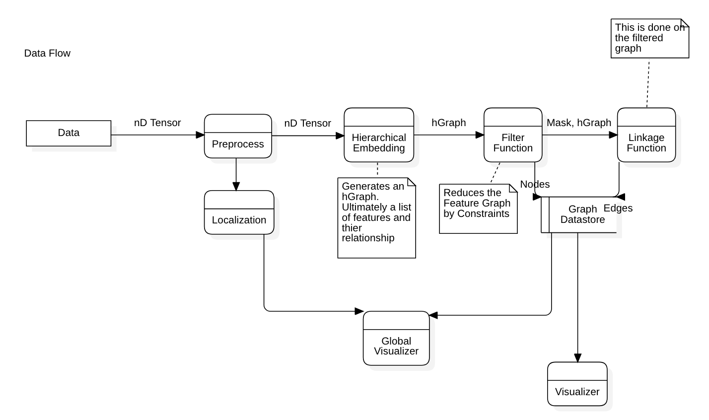

# RK-Diagrams and Pipeline

The following repo is a generalized implementation of the 
[A novel approach ot TDA: RK Diagrams Paper]() written by Andor Kesselman 
and Animikh Roy.

The core packages of this can be extended to many use csaes. Check out the 
LIGO DK-Diagram Pipeline for a specific implementation done on the LIGO dataset

### How to use:

A general flow diagram can be seen below: 

To model your data through RK-Diagrams, you must define the following: 

1. A Preprocess Pipeline
2. A Hierarchal Extraction Feature Embedding
3. A Filter function
4. A Linkage function
5. Localization

See the ligo-flow for an example

### Section: Computational Pipeline

0. Introduction
   - NxM Tensor -> RK-Model -> RK-Diagram
   - RK SDK
1. Prepocess Pipeline
   - NxM Tensor -> NxM Tensor
2. Localization Algorithm
   - NxM Tensor -> nD Tensor that localizes
3. Hierarchical Feature Extraction
   - NxM Tensor -> HierarchicalGraphModel (HGM)
4. Filter Functions
   - HGM -> GraphMask
5. Linkage Functions
   - HGM -> List[Edges]
6. RK-Models. 
   - As a composite structure built from 3,4, and 5
7. Putting it together in an RK-Model Pipeline
8. Visualization
   - RK-Models -> RK-Diagrams. Visualization Functions and Interfacing (locally and globally)
9. Datastore 
10. RK Toolkit
   - Repository and how it works
11. Extension: RK-Diagram Toolkit w/ LIGO
12. Areas of further reasearch and known shortcomings
   - Serial pipeline
   - ML
   - PH
